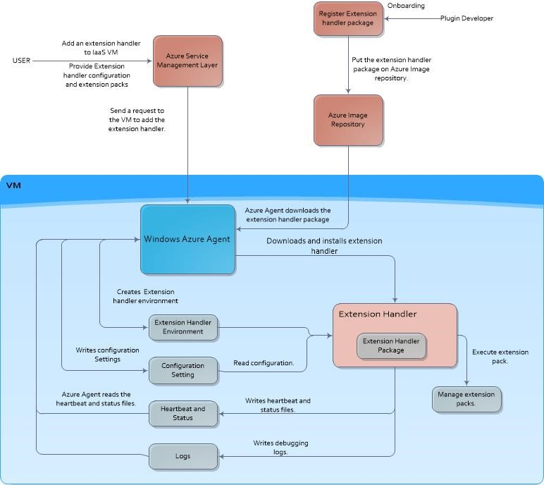

# Overview

In order to make the Microsoft Azure IaaS VMs customizable, Microsoft Azure is releasing a set of capabilities which will enable users to automate software deployment and configuration on IaaS VMs. As a part of these capabilities, a protocol is being released which can be used by various existing VM customization products to integrate with the Microsoft Azure VM ecosystem. This document discusses the requirements to participate in Microsoft Azure VM ecosystem and provides a guide for integrating VM customization products with Microsoft Azure.

## Terminology

| Teminology | Description |
|:---------------:|:----- |
| WALA | The Microsoft Azure component that runs inside the Linux VM and is responsible for managing the extension handlers. You can get the source code of WALA from https://github.com/Azure/WALinuxAgent. |
| Handlers | Partner authored component to deliver software and configuration to the customer VM. This component needs to implement handler configuration and status contracts and be provided as a handler package. Generally a handler will consist of an Azure interoperability wrapper around an existing VM customization product. In the overview documents handlers are more broadly referred to as `extensions`. The term `handler` and `extension` are used somewhat interchangeably. |
| Extension Pack | Specific job, workload, or script to be executed by the extension handler. |
| Handler identity | An identifier used to uniquely define the handler. This identity is a tuple of <Handler name>, <Publisher> and <Version> |
| Handler Manifest | A JSON based manifest that defines various properties needed by WALA to manage the handler. |

## Requirements

To participate in the Microsoft Azure ecosystem, any VM customization product needs to create a handler that implements the WALA defined protocol to integrate with the Azure ecosystem. The basic requirements for creating a handler that implements the Azure protocol are:

1. Handler Packaging – The Handler should be packaged as a zip file. This zip package should contain all the binaries related of the handler and HandlerManifest. This package needs to be registered with the Azure image repository. Azure image repository is responsible for managing all versions of all the handlers that are registered with the Azure ecosystem.

2. Handler Environment - Handler needs the capability to read the environment file in the format that WALA defines. The environment file defines the locations of various files and folder that the handler needs to use for reading configuration and writing back heartbeat and status.

3. Handler Configuration – Various extension packs that the handler needs to manage are passed to the handler in form of configuration settings. For example if a script is needed by the handler to install an extension, that script is passed to it via the handler configuration file. The handler should have the ability to read this file in the format defined by the Azure Agent and should be able to execute its contents and report the status of that execution with a frequency that complies with the Azure Agent protocol.

4. Handler heartbeat and status – The handler is supposed to report the status of the most recently executed configuration with a frequency that complies with the Azure Agent protocol. In addition to status, if the handler opts into reporting heartbeat it needs to report the heartbeat for the complete lifetime of the handler on the VM with a frequency that complies with the Azure Agent protocol.

## Architecture Overview

The below diagram gives an overview of how the handlers are supposed to interact with the Azure ecosystem.

